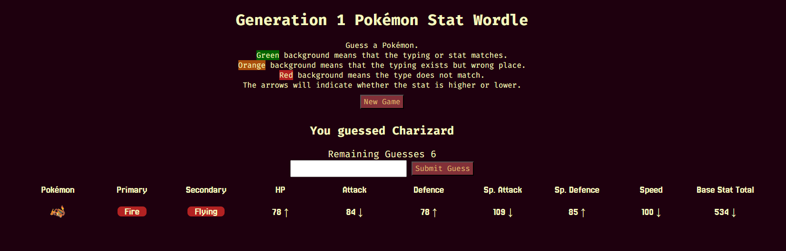

# Generation 1 Pokémon Stat Wordle

  

### Play the game here

## Background

I chose a Pokémon Wordle game to help demonstrate everything that I have learned in Unit 1 of my General Assembly Software Engineering Bootcamp. This browser game requires you to iterate through arrays and objects. I used Flex box and CSS Grid to position the content. Manipulating the DOM to inject the guesses on screen.

## Game Description

This is a game were you have to guess a randomly selected Pokémon.
For each guess it will show the Pokémon's typings, stats, and base stat total.
There will be indications on whether the typing matches or if the stat is higher lower or matches.

## Game Instructions

You have 7 tries to guess the right Pokémon.  
Green background means that the typing or stat matches.  
Orange background means that the typing exists but wrong place.  
Red background means the type does not match.  
The arrows will indicate whether the stat is higher or lower.

## Technologies Used

* HTML
* CSS
* JavaScript
* [Coolors.co](https://coolors.co/)
* Visual Studio Code
* Google Fonts 
    * Fira Code 
    * Jersey 25

## Future Enhancements

Update the dropdown list to be an autocomplete dropdown and provide some stats with the pokemon name.  
Expand data set to include more Pokémon generations.  
Let user limit what information they see.